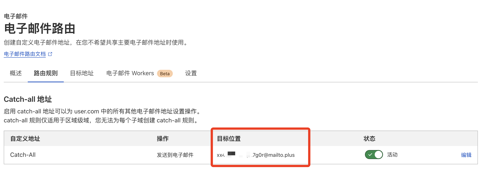
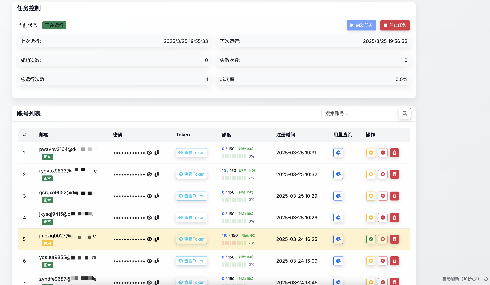
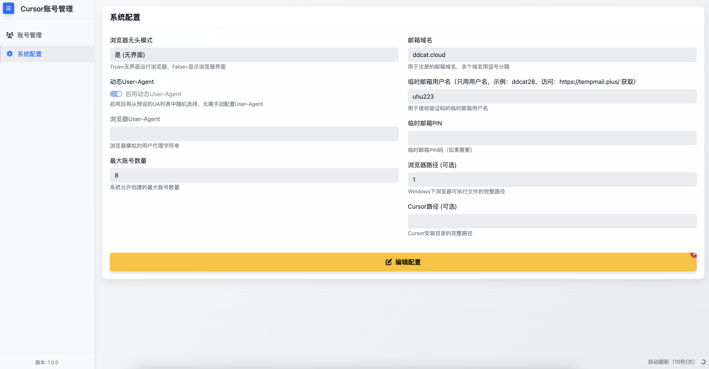
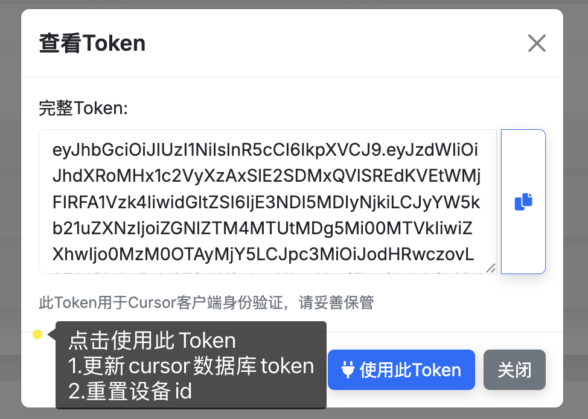

# Cursor Auto Register 本地开发指南

本项目是建在巨人肩膀上的一个开源项目，不做收费，仅供学习参考。
参考项目：

- [chengazhen/cursor-auto-free](https://github.com/chengazhen/cursor-auto-free)：Cursor Pro 自动化工具

- [cursor-account-api](https://github.com/Elawen-Carl/cursor-account-api)：Cursor Account API


## 环境要求
- Python 3.10+
- pip (Python包管理器)

## 本地开发设置步骤

1. 安装 Python 依赖
```bash
pip install -r requirements.txt
```

2. 配置环境变量
- 按照 `config.py` 配置 `.env` 环境参数

## 使用说明

### 1. 环境变量配置：
在项目根目录创建 .env 文件：
```
# 多个域名使用逗号分隔
EMAIL_DOMAINS=xxx.xx

# 临时邮箱用户名
EMAIL_USERNAME=test
# 临时邮箱PIN码（如果需要）
EMAIL_PIN=

# 数据库URL
DATABASE_URL="sqlite+aiosqlite:///./accounts.db"

# ===== API服务配置 =====
# API服务监听主机地址，0.0.0.0 允许非本机访问
API_HOST="0.0.0.0"
# API服务端口号
API_PORT=8000
# 是否启用UI
ENABLE_UI=True
# 最大注册账号数量
MAX_ACCOUNTS=1

# windows用户部分安装时是自定义目录安装的，需要修改该配置
#CURSOR_PATH="D:\devtools\cursor"
```
### 参数特殊说明：

- EMAIL_DOMAINS：自己申请的邮箱，并已将DNS解析到cloudflare上了

- EMAIL_USERNAME： https://tempmail.plus/ 获取到的邮箱前缀，示例：ddcat

  需要 cloudflare 上配置转发，可以参考：https://blog.csdn.net/qq_50082325/article/details/144530594 

  把 Catch-all地址 都转发到 tempmail.plus 获取到的邮箱即可

  


### 3. 数据持久化：

数据库文件会保存在 `accounts.db` 文件
日志文件会保存在容器内的 `api.log`
*注意事项：*
确保 `.env` 文件中的配置正确
数据目录 `accounts.db`需要适当的权限
容器内使用无头模式运行Chrome浏览器
API服务默认在8000端口运行

### 检查API服务是否正常运行
```
curl http://localhost:8000/health
```

## API 端点

- `GET /accounts` - 获取所有账号
- `GET /account/random` - 随机获取一个账号
- `POST /account` - 创建新账号

## 可视化页面
运行服务器后，访问：
- UI: http://localhost:8000/

  

  

  

## API 文档
运行服务器后，访问：
- Swagger UI: http://localhost:8000/docs
- ReDoc: http://localhost:8000/redoc

## 开发工具建议
- Cursor 或 PyCharm

## 调试提示
1. 查看日志
```bash
tail -f app.log
```


## 免责声明

本扩展仅供学习和测试使用. 使用本扩展可能违反 Cursor 的服务条款,
请自行承担使用风险.

您可以:

- ✅ 复制、分发本项目
- ✅ 修改、演绎本项目
- ✅ 私人使用

但必须遵循以下规则:

- 📝 署名 - 标明原作者及修改情况
- 🚫 非商业性使用 - 不得用于商业目的
- 🔄 相同方式共享 - 修改后的作品需使用相同的协议